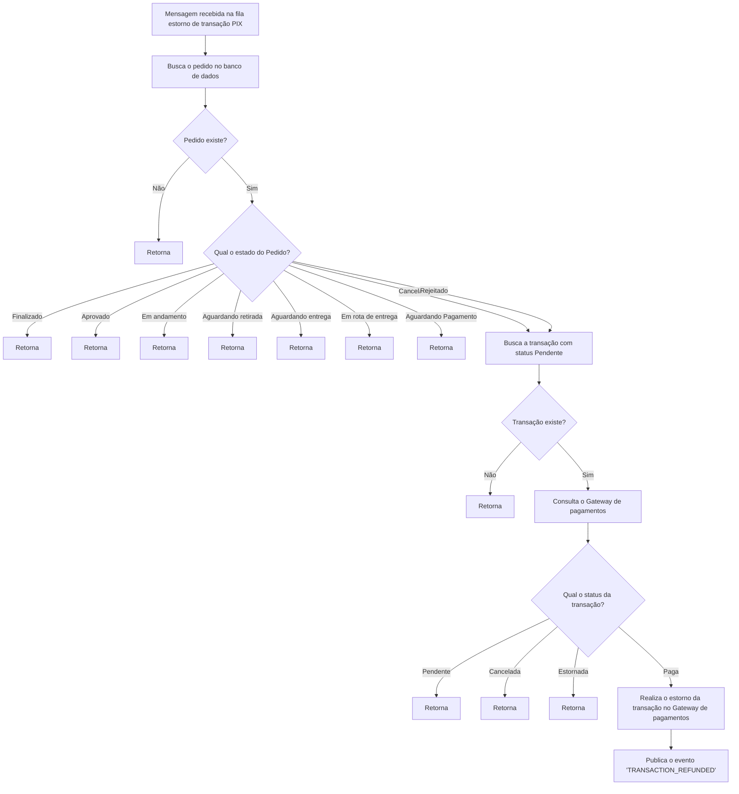

# Fluxo de execução do recebiento de callback de pagamento

```mermaid
 flowchart TB
    A1[Mensagem recebida na fila estorno de transação PIX] -->  B1[Busca o pedido no banco de dados]
    B1 --> B2{Pedido existe?}
    B2 -- Não --> B3[Retorna]
    B2 -- Sim --> C1{Qual o estado do Pedido?}
    C1 -- Finalizado --> C2[Retorna]
    C1 -- Aprovado --> C3[Retorna]
    C1 -- Em andamento --> C4[Retorna]
    C1 -- Aguardando retirada --> C5[Retorna]
    C1 -- Aguardando entrega --> C6[Retorna]
    C1 -- Em rota de entrega --> C7[Retorna]
    C1 -- Aguardando Pagamento --> C8[Retorna]
    C1 -- Cancelado --> D1[Busca a transação com status Pendente]
    C1 -- Rejeitado --> D1[Busca a transação com status Pendente]
    D1 --> D2{Transação existe?}
    D2 -- Não --> D3[Retorna]
    D2 -- Sim --> E1[Consulta o Gateway de pagamentos]
    
    E1 --> F1{Qual o status da transação?}
    
    F1 -- Pendente --> F2[Retorna]
    F1 -- Cancelada --> F3[Retorna]
    F1 -- Estornada --> F4[Retorna]
    F1 -- Paga --> G1[Realiza o estorno da transação no Gateway de pagamentos]
    G1 --> G2[Publica o evento 'TRANSACTION_REFUNDED']
```